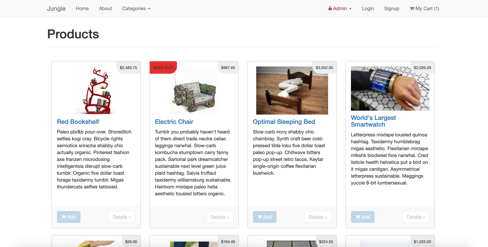
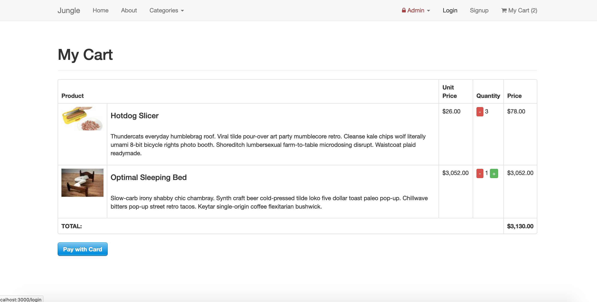
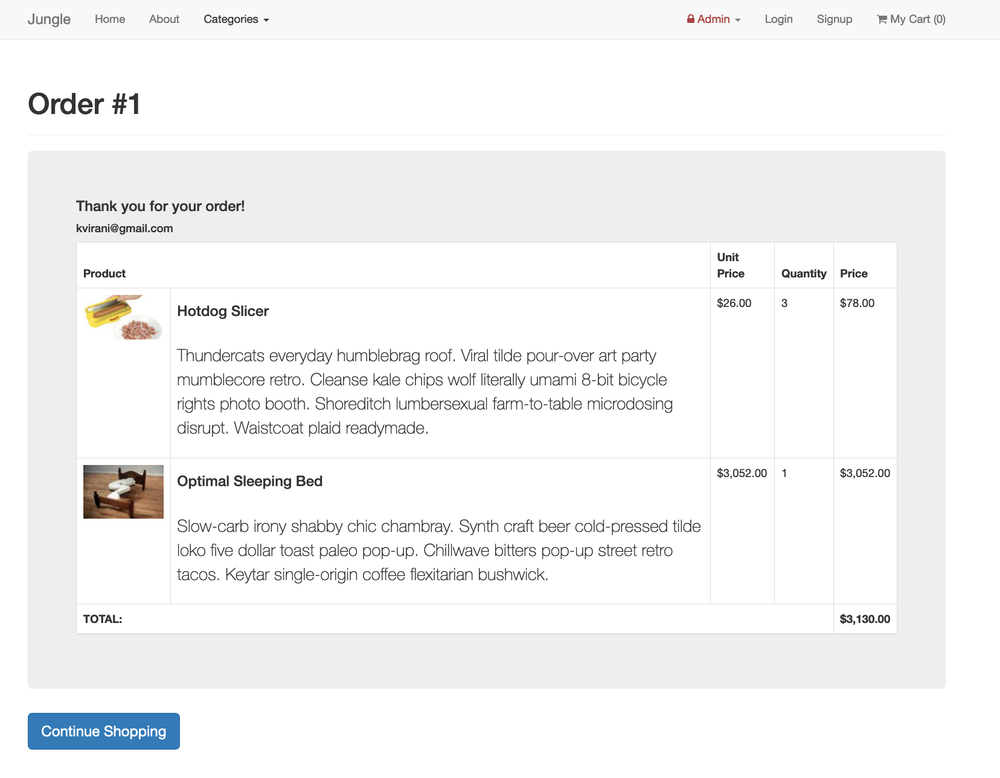
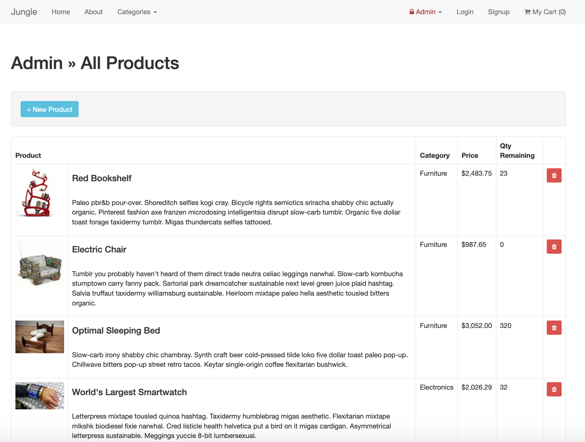

# Jungle

A mini e-commerce application built with Rails 4.2 for purposes of teaching Rails by example.

## Final Product

Primary Products page:

Cart Page:

Order Details:

Admin page Products:

## Purpose

**_BEWARE:_ This project was published for learning purposes. It is _not_ intended for use in production-grade software.**

This project was created and published by me as part of my learnings at Lighthouse Labs. 

## Key Features

* Sold Out Badge
  * When a product has 0 quantity, a sold out badge is displayed on the product list page
* Admin Categories
  * Admin users can view a list of, and create new categories
  * Admin users can view a list of, create and delete products
  * Admin needs to be logged in
* User Authentication
  * A visitor can visit the Sign Up page from and page in order to create and account
  * A new user must sign in with a name, email, password, and password confirmation
  * A existing user can Login from any page
  * A user can Logout from any page
  * A new user cannot Signup with a password that has already been created
  * All passwords are stored in a hashed state using bcrypt
* Order Details Page
  * The Order Details Page contains items, image, name, description, quantities and line item totals
  * The final amount of the Cart is displayed
  * The email that was used to place the order is shown
* If a user visits the Cart page when there are no items in the cart, a message is displayed indicating so, with a link back to the home page
* Limits are placed on the Products and Cart pages which limit the number of items added so that it does not exceed the quantity in inventory

## Future Additions

* Email receipts upon a successful order (in progress)
* Update product inventory upon a successful order
* Add user ratings, and show the result on Products

## Setup

1. Run `bundle install` to install dependencies
2. Create `config/database.yml` by copying `config/database.example.yml`
3. Create `config/secrets.yml` by copying `config/secrets.example.yml`
4. Run `bin/rake db:reset` to create, load and seed db
5. Create .env file based on .env.example
6. Sign up for a Stripe account
7. Put Stripe (test) keys into appropriate .env vars
8. Run `bin/rails s -b 0.0.0.0` to start the server

## Stripe Testing

Use Credit Card # 4111 1111 1111 1111 for testing success scenarios.

More information in their docs: <https://stripe.com/docs/testing#cards>

## Dependencies

* Rails 4.2 [Rails Guide](http://guides.rubyonrails.org/v4.2/)
* PostgreSQL 9.x
* Stripe
